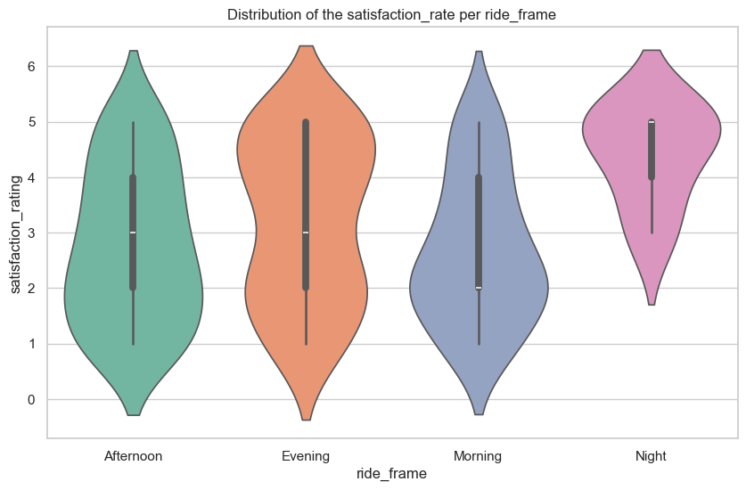

# Theme_park_analytics by Thierno Barry

## Business Problem
Over the past two quarters, Supernova Theme Park has seen uneven guest satisfaction scores and fluctuating revenue. Guest experience data collected during the summer season reveals recurring issues: long and inconsistent wait times, ride availability challenges, and overcrowding during peak hours — all of which reduce guest satisfaction.

At the same time, there are open questions around guest behavior: how frequently they visit, how recently, and what drives their in-park spending. The Park General Manager and the Marketing team need clear patterns to guide decisions — such as which ticket types, party sizes, purchase categories, ride times, or attraction states most strongly influence guest spending and satisfaction.

Given all the issues listed above and stakeholders' preoccupation, the central question becomes:
❓ How do operational efficiency and ticketing strategies work together to shape guest satisfaction, guest value, and ultimately park revenue?

## Stakeholders

Primary Stakeholder:
Park General Manager (GM)

Supporting Stakeholders:
Operations Director (staffing & queues), Marketing Director (promos & ticket mix)

## Overview of Database & Schema 
### Star Schema Explanation
This database uses a **star schema** design, with central **fact tables** (`fact_visits`, `fact_ride_events`, `fact_purchases`) linked to **dimension tables** (`dim_guest`, `dim_ticket`, `dim_attraction`) via foreign keys.  

**Benefits of this schema:**  
- Simplifies analytics by separating **measures** (spend, revenue, wait times) from **descriptors** (guest details, ticket type, attraction info).  
- Improves performance for queries and aggregations.  
- Easy to extend by adding new dimensions.  
- Business-friendly structure for answering questions such as revenue by ticket type, guest demographics, or attraction satisfaction.  

### Tables Overview

## Exploratory Data Analysis (SQL)

### Key Explorations
1. **distribution of the waiting minutes across ticket type:** The main idea is to uncover potential factors that lead to guest dissatisfaction. Delay in services or waiting time is  frustrating, By analyzing how waiting times vary across different ticket types, we can identify patterns that highlight where frustrations are most concentrated. This exploration helps guide further investigation and points to opportunities for operational improvements.
2. **Daily visits and daily spending** Daily performance is an excellent metric that provides a clear view of how well the business is doing. Exploring both daily visits and daily spending help patterns help uncover revenue fluctuations and guest engagement.This analysis not only reveals performance trends but also highlights underperforming days Allowing you to help operationnal team optimize staffing, ressource allocation and better service delivery.
3. **EDA Guest_behaviour( spending by category or purchasea and by party size):** This analysis takes a marketing-oriented perspective. Guest spending behavior is influenced by multiple factors, such as party size, purchase categories, and ticket types. Understanding these dynamics helps uncover which groups of guests spend more, what they purchase, and under what circumstances. These insights are useful for designing targeted marketing campaigns. This initial exploration is a necessary first step before diving into more advanced behavioral analysis.

> SQL queries can be linked: [/sql/01_eda.sql](Sql-files/sql:01_eda.sql)

## Feature Engineering (SQL)

### Created Features & Rationale
1. **hours_stayed (duration of the visit: short, medium, long):** Visit duration is a strong indicator of guest engagement. Longer stays may correlate with higher spending or satisfaction, while shorter visits could signal maybe that guests' expectations are not met or they have time constraints.

2. **wait_bins (length of waiting minutes: short, medium, long):** Waiting time directly impacts guest experience. Categorizing it helps identify which groups of visitors are most affected by delays and whether long waits are tied to dissatisfaction or reduced spending.

3. **visit_segment (based on spending: basic, standard, premium):** Segmenting visits by revenue they generated  allows the business to distinguish between low to high value experiences. help to uncover what types of visits contribute mostly to the revenue and in which conditions those visits occured (party_size, wait_time, guests, date or time of day)

4. **ride_frame (time of the ride: morning, afternoon, evening, night):** Time of day influences guest behavior and operational needs. Analyzing rides across time frames reveals peak periods, demand patterns, and opportunities for scheduling staff or offering targeted promotions.

## CTEs & Window Functions (SQL)

### Sample Querie & Snippets
<!-- Include short snippets of key CTE or window function queries -->
**CTE RFM**\
\

**Windows functions RANK AND SUM**\
\

> Full queries: [/sql/02_cte_window.sql](Sql-files/sql:04_ctes_windows.sql)

# Visuals (Python)

## Figure 1
  
*Caption for Figure 1*

## Figure 2
  
*Caption for Figure 2*

## Figure 3
  
*Caption for Figure 3*

# Insights & Recommendations

## For GM
<!-- Recommendations for General Management -->

## For Operations
<!-- Recommendations for Operations -->

## For Marketing
<!-- Recommendations for Marketing -->

# Ethics & Bias
<!-- Data quality, missing values, duplicates, margin not modeled, time window, etc. -->

# Repo Navigation

## /sql
<!-- SQL scripts -->

## /notebooks
<!-- Jupyter notebooks -->

## /figures
<!-- Saved figures/images -->

## /data
<!-- Raw or processed datasets -->
