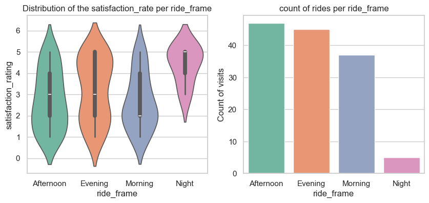
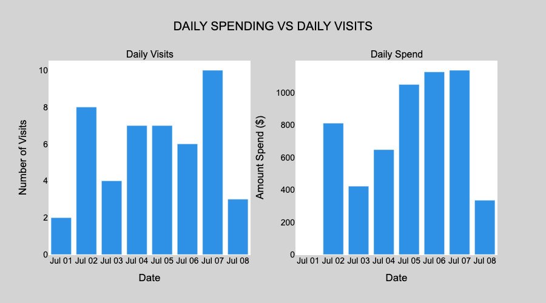
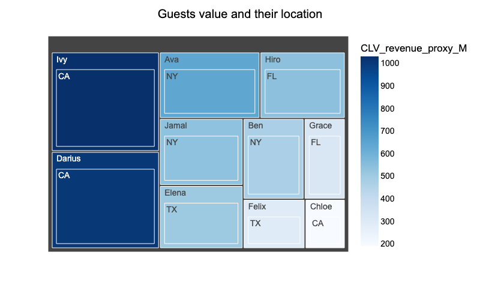

# Theme_park_analytics 
**Owner:** Thierno Barry

## Business Problem
Over the past two quarters, Supernova Theme Park has seen uneven guest satisfaction scores and fluctuating revenue. Guest experience data collected during the summer season reveals recurring issues: long and inconsistent wait times and overcrowding during peak hours — all of which reduce guest satisfaction.

At the same time, there are open questions around guest behavior: how frequently they visit, how recently, and what drives their in-park spending. The Park General Manager and the Marketing team need clear patterns to guide decisions — such as which ticket types, party sizes, purchase categories, ride times, or attraction states most strongly influence guest spending and satisfaction.

Given all the issues listed above and stakeholders' preoccupation, the central question becomes: \
❓ How do operational efficiency and ticketing strategies work together to shape guest satisfaction, guest value, and ultimately park revenue?

## Stakeholders

Primary Stakeholder:
Park General Manager (GM)

Supporting Stakeholders:
Operations Director (staffing & queues), Marketing Director (promos & ticket mix)

## Overview of Database & Schema 
### Star Schema Explanation
This database uses a **star schema** design, with central **fact tables** (`fact_visits`, `fact_ride_events`, `fact_purchases`) linked to **dimension tables** (`dim_guest`, `dim_ticket`, `dim_attraction`) via foreign keys. a **star schema** is a data modeling system for storing data using central fact tables that contains quantitative measurement surrounding by multiple dimension tables providing descriptive context.

**Benefits of this schema:**  
- Simplifies analytics by separating **measures** (spend, revenue, wait times) from **descriptors** (guest details, ticket type, attraction info).  
- Improves performance for queries and aggregations.  
- Easy to extend by adding new dimensions.  
- Business-friendly structure for answering questions such as revenue by ticket type, guest demographics, or attraction satisfaction.  

### Tables Overview

the database contains 3 fact tables interconnected, and linked to 3 dimensions tables via foreign keys
- `dim_attraction` linked to   `fact_ride_event` via *attraction_id*
- `fact_visits` linked to 
- 1. `dim_guest` via *guest_id*
- 2. `dim_ticket` via *ticket_type_id*
- 3. `fact_ride_event` via *visit_id*
- 4. `dim_date` via *date_id*
- 5. `fact_purchase` via *visit_id*

## Exploratory Data Analysis (SQL)

### Key Explorations
1. **distribution of the waiting minutes across ticket type:** The main idea is to uncover potential factors that lead to guest dissatisfaction. Delay in services or waiting time is  frustrating, By analyzing how waiting times vary across different ticket types, we can identify patterns that highlight where frustrations are most concentrated. This exploration helps guide further investigation and points to opportunities for operational improvements.
2. **Daily visits and daily spending** Daily performance is an excellent metric that provides a clear view of how well the business is doing. Exploring both daily visits and daily spending help patterns help uncover revenue fluctuations and guest engagement.This analysis not only reveals performance trends but also highlights underperforming days Allowing you to help operationnal team optimize staffing, ressource allocation and better service delivery.
3. **EDA Guest_behaviour( spending by category or purchasea and by party size):** This analysis takes a marketing-oriented perspective. Guest spending behavior is influenced by multiple factors, such as party size, purchase categories, and ticket types. Understanding these dynamics helps uncover which groups of guests spend more, what they purchase, and under what circumstances. These insights are useful for designing targeted marketing campaigns. This initial exploration is a necessary first step before diving into more advanced behavioral analysis.

> SQL queries here: [/sql/01_eda.sql](Sql-files/sql:01_eda.sql)

## Feature Engineering (SQL)

### Created Features & Rationale
1. **hours_stayed (duration of the visit: short, medium, long):** Visit duration is a strong indicator of guest engagement. Longer stays may correlate with higher spending or satisfaction, while shorter visits could signal maybe that guests' expectations are not met or they have time constraints.

2. **wait_bins (length of waiting minutes: short, medium, long):** Waiting time directly impacts guest experience. Categorizing it helps identify which groups of visitors are most affected by delays and whether long waits are tied to dissatisfaction or reduced spending.

3. **visit_segment (based on spending: basic, standard, premium):** Segmenting visits by revenue they generated  allows the business to distinguish between low to high value experiences. help to uncover what types of visits contribute mostly to the revenue and in which conditions those visits occured (party_size, wait_time, guests, date or time of day)

4. **ride_frame (time of the ride: morning, afternoon, evening, night):** Time of day influences guest behavior and operational needs. Analyzing rides across time frames reveals peak periods, demand patterns, and opportunities for scheduling staff or offering targeted promotions.

## CTEs & Window Functions (SQL)
We used window functions in combination with CTE to uncover trends without collapsing our data.
We used windows functions such as 
- Rank to rank high value guests within their homestate\
- Lag to retrieve to previous spend on the current\
- SUM to creating a running total
  
### Sample Querie & Snippets
<!-- Include short snippets of key CTE or window function queries -->
**CTE RFM**\
\

**Windows functions RANK AND SUM**\
\

> Full queries: [/sql/02_cte_window.sql](Sql-files/sql:04_ctes_windows.sql)

## Visuals (Python)

### Figure 1
  
*distribution guest satisfaction across ride times vs rides segment over time of day*:\
this figure shows us how the satisfaction is spread out for each time of the day. the peaks time are clearly afternoon and evening and most ratings tend to be low in afternoons and mornings rides.

### Figure 2
  
*General daily performance*\
july 7th account for the highest visits count and the highest revenue. However, July 5th and 6th have almost similar revenues while counting less visits.\
In terms of productivity, July 6th and 5th are the top 2, followed by the 7th.

### Figure 3
  
*Ranking guests along with their homestate*\
We can see that the top 2 high value guest come from California. New York comes next.

## Insights & Recommendations
### Attendance & Revenue Patterns
- The opening day (2 guests) had no spend data, but likely the least productive.
- Peak revenue day: 2025-07-07 – $1,138 from 10 visits
- Productivity metric (spend_per_visit) reveals that some days with fewer visits generated similar or higher revenue: 2025-07-06 has 188 revenue per visits(7).
### Guest Demographics & Revenue
- Top revenue states:
  1. California
  2. New York
- Lowest revenue state: Texas (14% of total revenue)
- Top guest: Ivy (guest_id 9) – 8 visits, $1,030 revenue (18% of total revenue), higher than TX or FL taken individually
- Marketing opt-in: Only Ava among the top 3 high-value guests has opted in, raising marketing efficiency questions
### Guest Behavior & Recency
- All guests visited either on the last or second-to-last recorded day (good recency).
- The minimum visits per guest is 3, in 8 days: pretty strong engagement
- We can classify guests in 3 behavioural types.
   1. High-value stable : e.g., Ben, high consistent spending across visits.
   2. High-potential volatile : e.g., Ava, variable spending, spend high on some visits, but 0 on others.
   3. Low-value : e.g., Grace, high visits but low spend.
- Nearly 60 % of the revenue is generated by visits having having party lower or equal to 2 while 51% of visits have party size greater than 2.
### Recommendations
#### For GM
<!-- Recommendations for General Management -->
- Focus on high values guests, recognize and reward in order to loyalize Ivy, Ben and Ava. consider special approaches for low value guests with high count of visits in order to raise their spendings.
- Optimize peak days: since some days have similar revenues despite having a big gap between their number of visits, managing staff, providing fast and a better experience for example can result in a higher daily revenue for those high attendance days such as Monday July 7. Focus on improving *spend_per_capita*
- Leverage small-party spending

#### For Operations
<!-- Recommendations for Operations -->
- Ensure staff can handle peak days efficiently to maintain high spend per visit and monitor service efficiency on days with higher guest counts
- Encourage premium ticket options since guests don’t downgrade and optimize layout or scheduling to maximize guest satisfaction during peak days.
- Be aware that fewer visits with optimized staff effort can increase revenue.

#### For Marketing
<!-- Recommendations for Marketing -->
- Only 1 of top 3 high-value guests opted into marketing. Reassess marketing strategy, to reach high spending not_opt_in guests.
- Focus on California and New york as high revenues states and explore marketing strategies to increase spend or visits from lower-revenue states (TX, FL).
- Tailor campaigns to guest segments: stable, volatile, and low-value spenders.
  
### Ethics & Bias
<!-- Data quality, missing values, duplicates, margin not modeled, time window, etc. -->
The initial database had several issues that we handled and clean to make it ready and efficient for analysis.
- recurent inconsistent strings encountered in several columns from multiple tables: We used Trim, lower, upper, replace to handle those
- Duplicates values: 16 found in fact ride events, that we deleted to conserve only one
- Conversion of the spending or purchases columns from cents to dollars
- Missing values:Imputation used to fill in nulls in some columns
  1. amount column in fact_purchase using the average amount per category. see sql\02_cleaning
  2. spending column in fact_visits using the average spend per visit per day

## Repo Navigation
#### [Sql_files](Sql-files)
####   [raw_data](data)
####     [notebook_files](notebooks)
####       [figures_png](figures)

